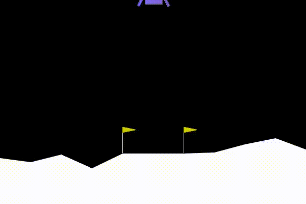
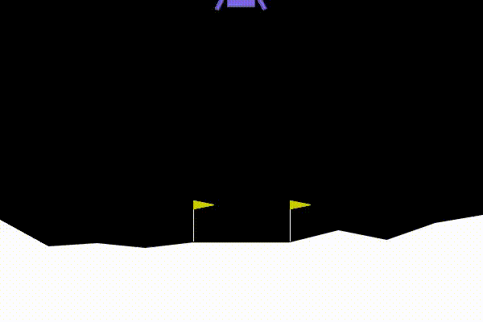

# Artificial_Intelligence_SaifAlomari_Winter2026
### Saif Alomari

This repository contains Artificial Intelligence projects developed during Winter 2026.  
The focus is on reinforcement learning, intelligent agents, and autonomous decision-making systems.

Each project explores how agents learn through interaction, feedback, and optimization of long-term reward.

---

# 🚀 Project 1: Lunar Lander (Deep Q Learning)

This project implements a Deep Q Network (DQN) agent to solve the LunarLander-v3 environment. The agent learns to safely land a spacecraft between designated flags through reward-based interaction with the environment.

Over the course of training, the model transitions from unstable, crash-prone behavior to consistent and controlled landings, achieving a mean evaluation reward above 200 across 100 test episodes. This project demonstrates practical reinforcement learning applied to autonomous decision-making and control.

---

## 🎬 Agent Behavior Evolution

### Episode 150 – Early Training (Chaotic Behavior)

In early training, the agent behaves randomly, fires engines without clear strategy, and frequently crashes.

---

### Episode 1775 – Stable Landing Policy

After sufficient training, the agent demonstrates controlled descent, stabilized orientation, and consistent landings between the flags.

---

# 🧠 Project 2: Prompt Critic Agent (Iterative Prompt Improvement)

This project explores prompt engineering using an autonomous **Critic agent** that improves prompts designed to generate Python code.

Instead of manually rewriting prompts, the system uses a language model to analyze a prompt and produce a clearer, more structured version that is more likely to generate robust and executable Python code.

The Critic agent focuses on improving prompts that involve machine learning or data processing tasks.

---

## 🔁 Prompt Improvement Pipeline

The notebook implements an **iterative prompt refinement loop**.

1. **Original Prompt**  
   A user provides a prompt requesting Python code.

2. **First Revision**  
   The Critic agent analyzes the prompt and rewrites it to improve clarity and structure.

3. **Second Revision**  
   The improved prompt is passed through the Critic again to further refine instructions and remove ambiguity.

This process demonstrates how LLMs can be used not only to generate code but also to **improve the instructions used to generate that code**.

