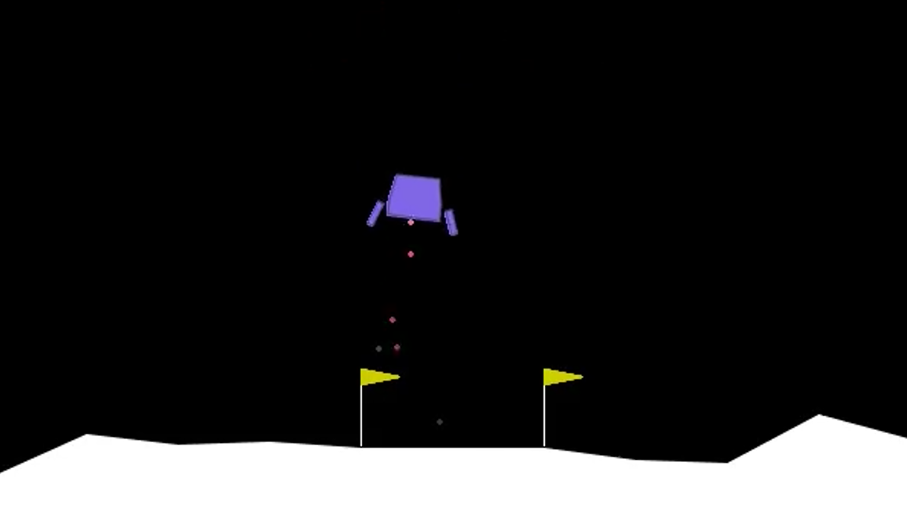
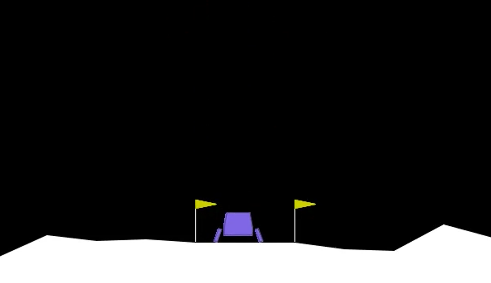

# 🚀 Project 1: Lunar Lander (Deep Q Learning)

## 📌 Overview

This project implements a Deep Q Network (DQN) agent to solve the **LunarLander-v3** environment.

The goal is to train an intelligent control policy that allows a lunar lander to safely descend and land between two flags while minimizing crashes and inefficient fuel usage.

The agent learns entirely through reward-based interaction with the environment.

---

## 🎬 Example Agent Behavior

### Early Training Behavior

During early training, the agent behaves randomly, frequently crashes, and receives strongly negative rewards.

---

### Stable Landing Behavior

After sufficient training, the agent stabilizes descent, controls orientation, and consistently lands between the flags.

---

## 🧠 Method

The agent is trained using **Deep Q Learning (DQN)**.

Instead of storing Q-values in a lookup table, a neural network approximates the action-value function.  
This enables learning in continuous state environments including:

- Position
- Velocity
- Angle
- Angular velocity

Training stability is improved using:
- Experience replay
- Target network updates
- Controlled exploration decay

---

## ⚙️ Training Configuration

- Maximum timesteps: 600,000  
- Training duration: 2,000 episodes  
- Proper exploration decay schedule  

An earlier attempt resulted in mostly random behavior due to incorrect exploration scheduling.  
After correcting the training configuration, the agent achieved consistent rewards above 200.

---

## 📈 Learning Behavior

The training process shows clear learning phases:

**Episodes 0–300**  
Highly unstable behavior with frequent crashes.

**Episodes 300–1000**  
Gradual stabilization and partial control.

**Around Episode 1000**  
Breakthrough phase where rewards transition from negative to positive.

**Episodes 1300–1800**  
Stable high performance with average reward exceeding 200.

---

## 🏆 Final Evaluation Results

Evaluation performed over 100 deterministic episodes:

- **Mean Reward:** 206.46  
- **Mean Episode Length:** 183.35  

The trained agent demonstrates consistent and reliable landing behavior across varied initial conditions.

---

## 📂 Repository Structure
